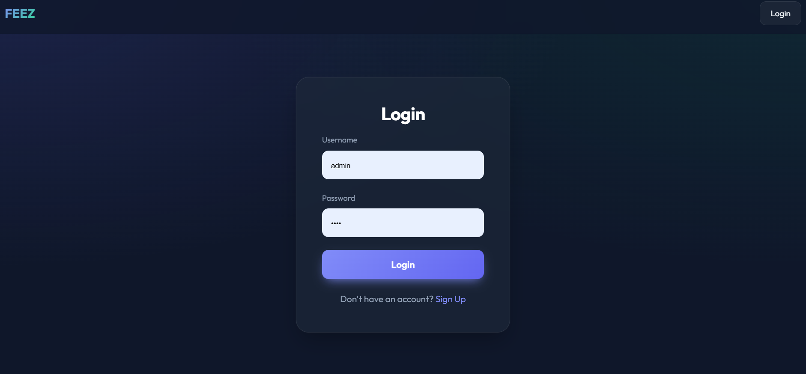
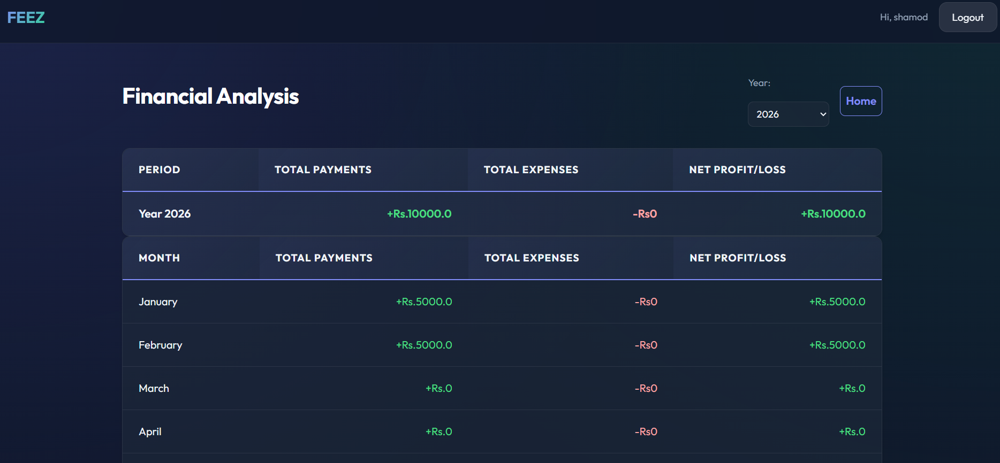

# FEEZ - Fee Management System

A modern, real-world fee management system built for educational institutions to efficiently handle student payments, expenses, and financial reporting. This production-ready application was developed to address the specific needs of educational institutions requiring robust fee collection and financial tracking.

## 🎯 Problem Statement

Educational institutions often struggle with:
- Manual fee collection and tracking
- Lack of real-time financial insights
- Inefficient handling of partial payments and discounts
- Difficulty in managing holidays and special discount periods
- No centralized system for tracking both income and expenses

## 🚀 Solution Overview

FEEZ provides a comprehensive solution with:
- Automated fee calculation with support for discounts and holidays
- Real-time financial reporting and analytics
- Streamlined payment approval workflows
- Student-specific fee management
- Secure user authentication and role-based access control

## ✨ Key Features

### Student Management
- Add, edit, and manage student records
- Track individual payment history
- Handle student-specific discounts and waivers

### Fee Processing
- Record and track fee payments
- Support for partial payments
- Automatic calculation of pending amounts
- Draft and approval workflow for payments

### Financial Management
- Expense tracking and approval system
- Comprehensive financial reporting
- Annual and monthly financial summaries
- Exportable reports

### Holiday & Discount Management
- Define holiday periods with full or partial fee waivers
- Student-specific discount management
- Flexible discount types (percentage or fixed amount)

### User Experience
- Modern, responsive UI with dark mode
- Real-time search and autocomplete
- Interactive dashboards
- Mobile-friendly interface

## 🛠️ Tech Stack

### Backend
- **Django 4.2+** - Python web framework
- **Django ORM** - Database abstraction
- **Django Templates** - Server-side rendering

### Frontend
- **HTMX** - Dynamic, AJAX-powered interfaces
- **Vanilla JavaScript** - Client-side interactivity
- **CSS3** - Modern styling with CSS variables
- **Responsive Design** - Works on all devices

### Database
- **PostgreSQL** - Robust, production-ready database

### Deployment
- **Environment Variables** - Secure configuration
- **WSGI/ASGI** - Production deployment ready

## 🏗️ System Architecture
```text
├── Django (Backend)
│ ├── Models (Student, Payment, Expense, Holiday) 
│ ├── Views (HTMX endpoints) 
│ └── URL Routing 
│ ├── HTMX (Frontend) 
│ ├── Dynamic Forms 
│ ├── Real-time Updates 
│ └── Interactive UI 
│ └── PostgreSQL (Database) 
├── Student Records 
├── Payment Transactions 
├── Expense Tracking 
└── Holiday/Discount Rules

```

## 📸 Screenshots

## Screenshots

### Add payment Page


### Login Page


### Analyze


## 🚀 Installation Guide

### Prerequisites
- Python 3.9+
- PostgreSQL 13+
- Node.js 16+ (for frontend assets)

### Setup Instructions

1. **Clone the repository**
   ```bash
   git clone https://github.com/Shamodoshan/Fees.git
   cd fees
   ```
2.**run server**
  ```bash
    python manage.py runserver
   ```
Access the application
Open http://localhost:8000 in your browser
Log in as admin password-test@1234

```md
## 📂 Project Structure

```text
fees/
├── config/               # Django project configuration
├── core/                 # Main application
│   ├── migrations/       # Database migrations
│   ├── templates/        # HTML templates
│   ├── __init__.py
│   ├── admin.py          # Admin interface config
│   ├── apps.py
│   ├── models.py         # Database models
│   ├── tests.py
│   └── views.py          # View functions
├── static/               # Static files (CSS, JS, images)
├── templates/            # Base templates
├── .env.example          # Example environment variables
├── manage.py             # Django management script
└── requirements.txt      # Python dependencies
```

🔒 Security Considerations <br>

   Authentication: Secure user authentication system<br>
   CSRF Protection: Built-in Django CSRF protection<br>
   HTTPS: Should be enforced in production<br>
   Environment Variables: Sensitive configuration stored in environment<br>
   Input Validation: Server-side validation of all inputs<br>

🤝 Contributing<br>

   Fork the repository
   Create a feature branch (git checkout -b feature/AmazingFeature)<br>
   Commit your changes (git commit -m 'Add some AmazingFeature')<br>
   Push to the branch (git push origin feature/AmazingFeature)  <br>
   Open a Pull Request<br>


👥 Author & Credits<br>

   Developer: Shamod Oshan<br>
   Built With: Django, HTMX, PostgreSQL<br>

📝 Client-based Disclaimer<br>

   This application was developed for a client as a custom solution. While the core functionality is generic, certain features may be specific to the client's requirements.<br>
